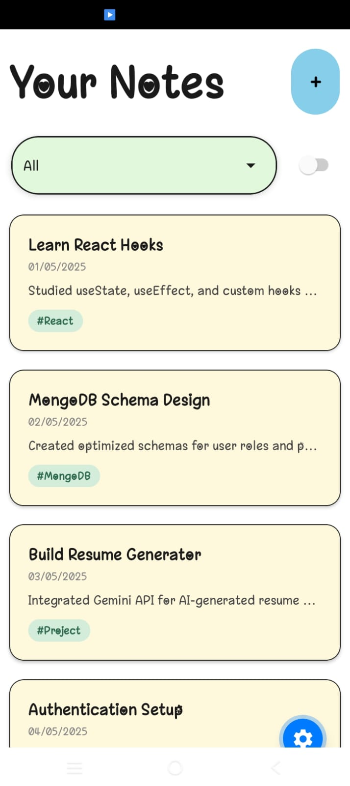
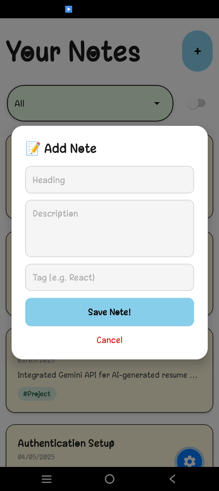

# 📝 NoteApp

A modern cross-platform note-taking app built with **Expo** and **React Native**.  
Create, manage, and organize your notes seamlessly across **Android, iOS, and Web**.

---

## ✨ Features

- 📌 Create, edit, and delete notes
- 🔍 Instant search functionality
- 🌙 Clean and responsive UI with dark mode support
- ⚡ Fast performance powered by Expo
- 📱 Full cross-platform support (Android, iOS & Web)
- 🗂 Well-organized note management
- 🔄 Real-time updates

---

## 📸 Preview

<!-- Add your screenshots here -->

<div align="center">
  
  
</div>

---

## 🚀 Tech Stack

- **React Native**
- **Expo**
- **TypeScript**
- **Expo Router**

---

## 📂 Project Structure

```bash
NoteApp/
├── app/              # App screens & routes (Expo Router)
├── assets/           # Images, fonts, icons, screenshots
├── components/       # Reusable UI components
├── constants/        # App constants and themes
├── hooks/            # Custom React hooks
├── scripts/          # Utility scripts
├── package.json
├── tsconfig.json
└── README.md

🛠 Installation
Bash# Clone the repository
git clone https://github.com/aditya07879/NoteApp.git

# Navigate to project directory
cd NoteApp

# Install dependencies
npm install

▶ Running the App
Bash# Start the development server
npx expo start
Then open the app on:

📱 Expo Go (Scan QR code)
🤖 Android Emulator
🍎 iOS Simulator
🌐 Web Browser (w key in terminal)


📦 Build for Production
Bash# Android
eas build -p android

# iOS
eas build -p ios

🧪 Linting
Bash# Run ESLint
npx expo lint

📚 Learn More

Expo Documentation
React Native Documentation
Expo Router


🤝 Contributing
Contributions, issues, and feature requests are welcome!

Fork the project
Create your feature branch (git checkout -b feature/amazing-feature)
Commit your changes (git commit -m 'Add some amazing feature')
Push to the branch (git push origin feature/amazing-feature)
Open a Pull Request


⭐ Support
If you like this project, please give it a ⭐ on GitHub!

👨‍💻 Author
Made with ❤️ by Aditya
